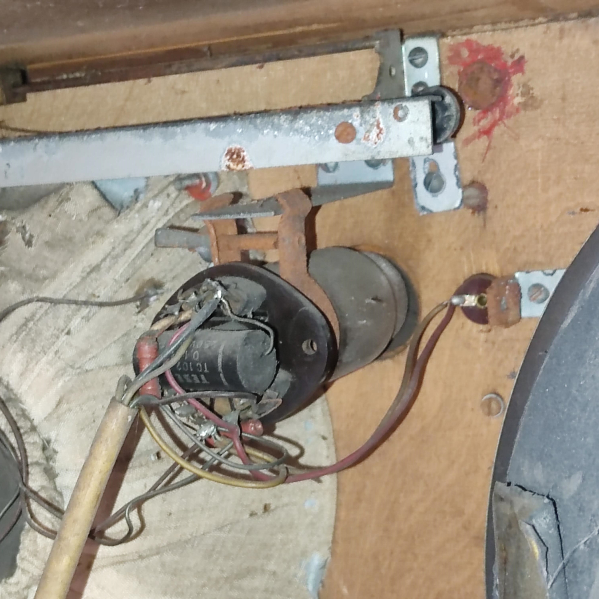
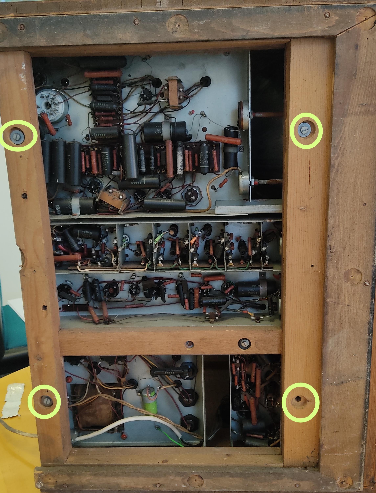

## Plan
1. Remove back panel (Absent in our case)
1. Unscrew and remove the "green eye" (image below):  

3. Desolder speaker wires
4. Remove the under-side panel
5. Remove the four screwsthat hold the undercarriage (image below)  

6. Slide out the whole under-carriage
7. Congrats, you're done!  

*P.S: Some models might have third party accessories installed that we don`t, your disassembly might not be as stream-lined as ours.*