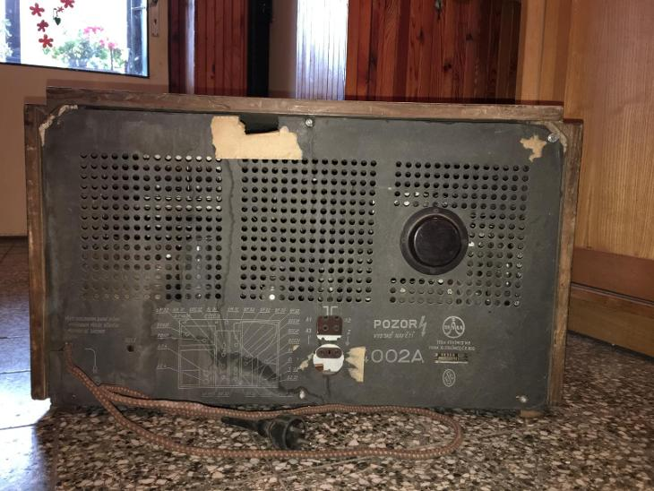
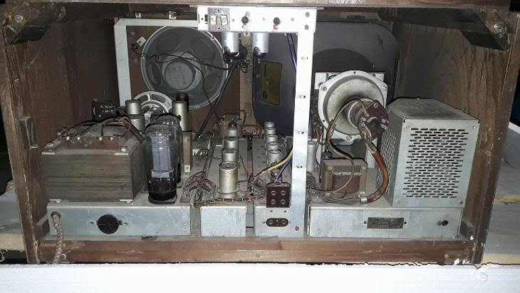
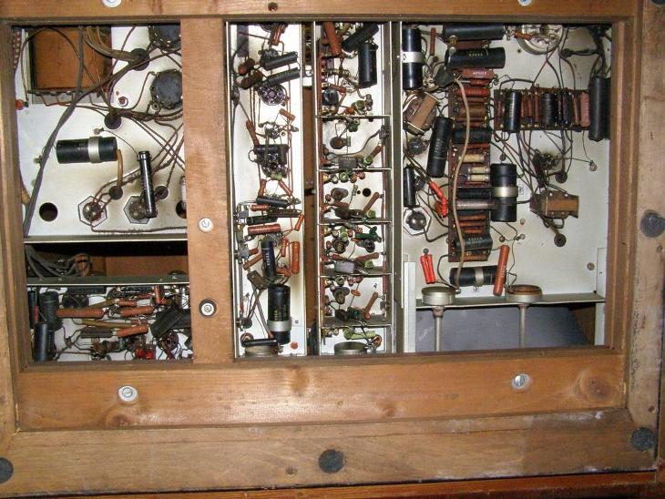
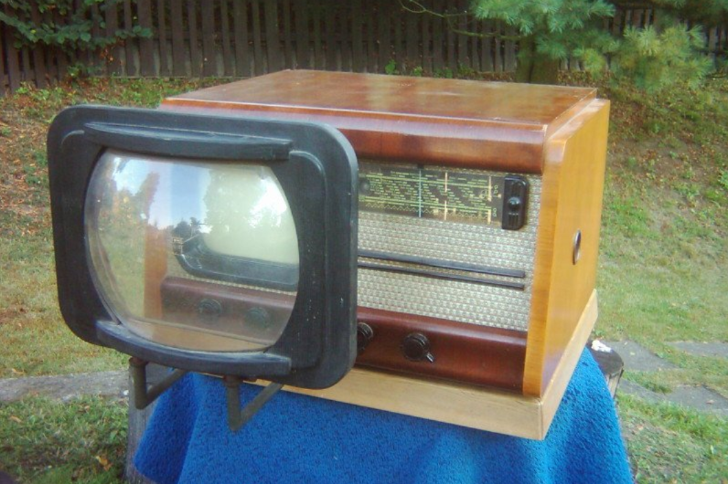
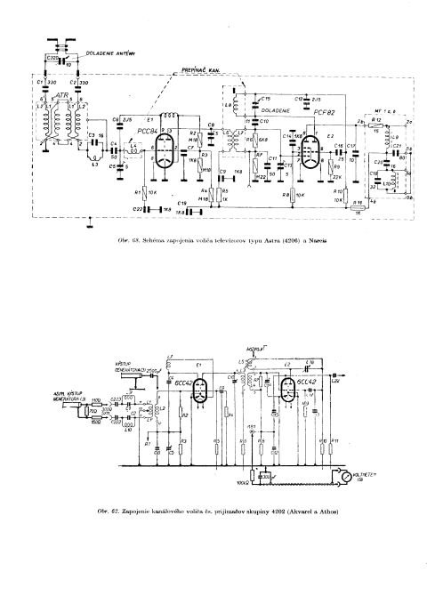

# TESLA-TV
The journey of repairing an old czechoslovak TV with a radio right from the 50s, the Tesla 4002A.  
If you have any more info, don't be afraid to add!  

##  Links

- Radio-forum page of [someone that restored another 4002A](https://radio-forum.cz/domains/radio-forum.cz/viewtopic.php?f=5&t=2680)
- Web page of the Virtual Museum of historical radio engineering [about the Tesla 4002A](http://www.oldradio.cz/ts4002.htm)

## Videos

[Tesla Rádio](https://www.youtube.com/channel/UCCJoa_LD4eVVtKMd7WoqOlQ/featured) playlist on a full repair:
1. [Chassis disassembly](https://youtu.be/HPPeF0AOeFc)
1. [Cleaning and parts](https://youtu.be/z7r_VDadZVk)
1. [Radio repair](https://youtu.be/8mm_Bx_WPbE)
1. [Audio amplifier](https://youtu.be/SjI0ftzy1p8)
1. [Video amplifier](https://youtu.be/JNCoHwkTZT8)
1. [Screen module](https://youtu.be/2wmb6PL6X1k)
1. [Radio test](https://youtu.be/lCmjv1jdO2Q)
1. [TV test](https://youtu.be/4sy0-bGlr64)
1. [New screen](https://youtu.be/CA-zlBT4qpI)
1. [Full TV test](https://youtu.be/xTgOFabGAY8)

## Images

- Images of [our TV](https://drive.google.com/drive/folders/1pmucJz_E2s95HYRwpUuAKW5byRP6rvud?usp=sharing) (Google Drive folder)  

Other TVs
_________
- Back panel:   

- Complete interior:  

- Under-side electronics:  

- 4002A with magnifying glass:  

          
## Schematics and Instructions

- Schematics of the TV from [radiomuseum.org](https://drive.google.com/drive/folders/1szKEjZV_29mjgeDUi5SEOpvviG2fFBpa?usp=sharing) (Google Drive folder)  
- Schematics of the radio circuit from teslakov.7x.cz:  
          
          
- From radiojournal.cz:  
[Schematics](http://www.radiojournal.cz/schemata/4002asch.pdf) (pdf)  
[User manual](http://www.radiojournal.cz/schemata/4002arj.pdf) (pdf)
- Service manual from [elektrotanya.com](https://drive.google.com/drive/folders/1jGgMQhIzVninX8vL8_PCoGSZZD5pMYRn?usp=sharing) (pdf)  
